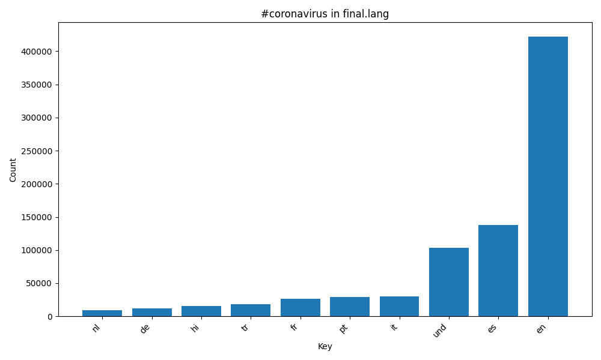
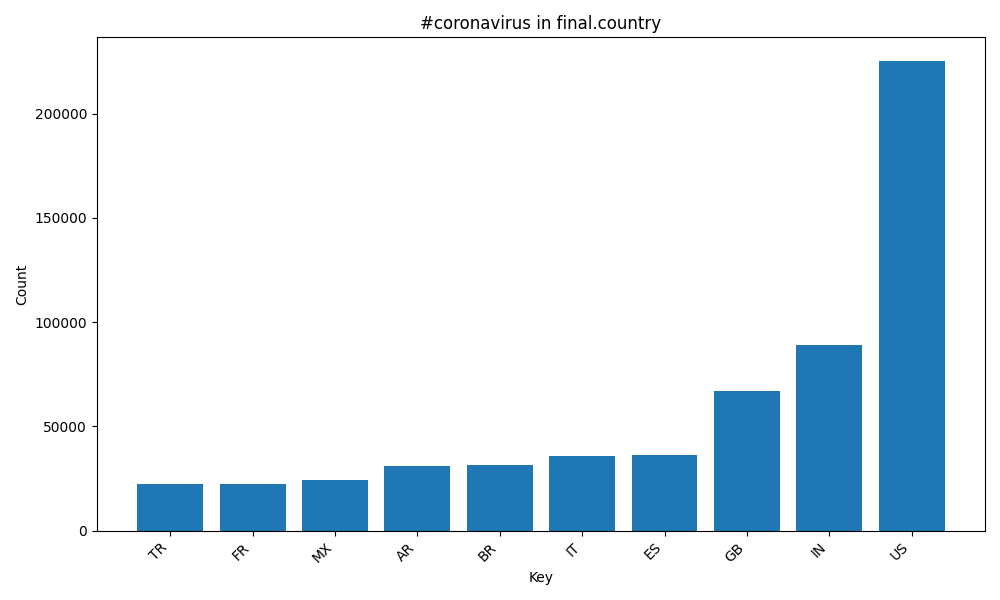
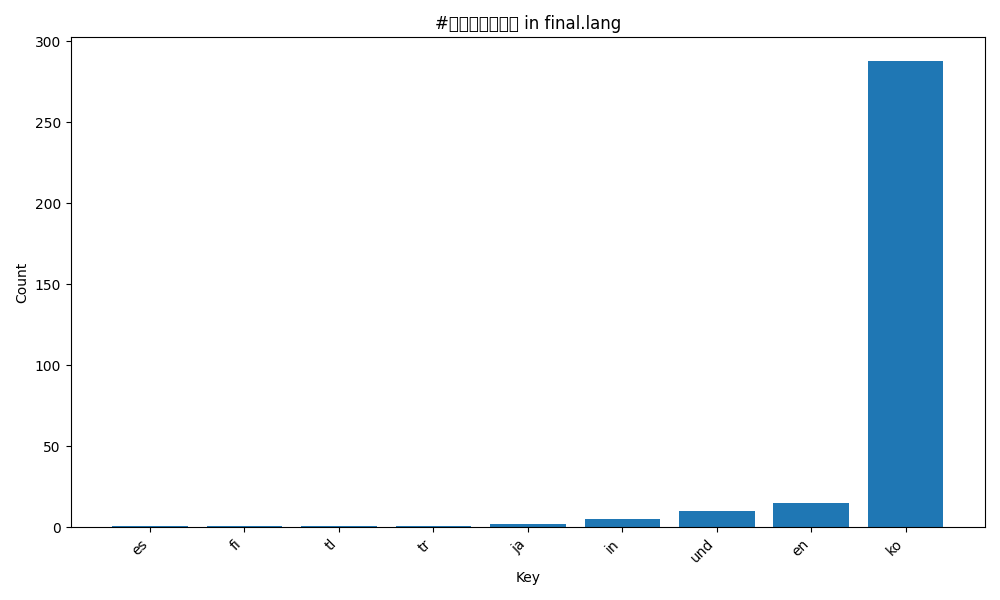
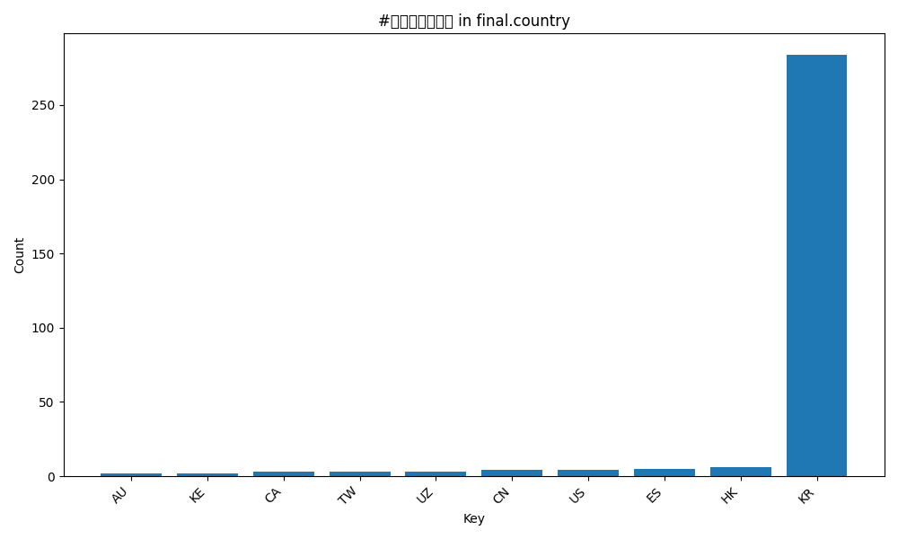
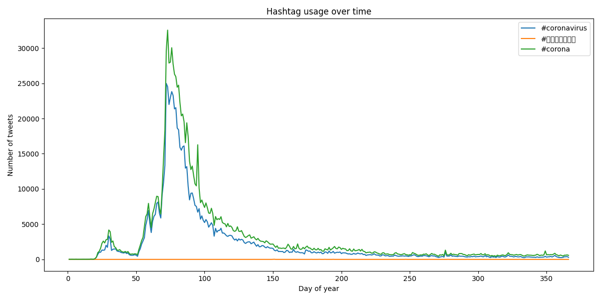

# Coronavirus Twitter Analysis

This project analyzes geotagged Twitter data from 2020 to track coronavirus-related hashtag usage across languages, countries, and time. I built a Python-based MapReduce pipeline on a remote Linux server to process daily tweet archives in parallel, aggregate the results into yearly summaries, and generate visualizations that highlight multilingual and geographic trends in social media activity.

## Why this project matters

Large social media datasets are messy, multilingual, and too large to process efficiently in a single manual workflow. This project demonstrates how to design a scalable analytics pipeline that transforms raw JSON tweet archives into structured summaries and decision-ready visual outputs.

## What I built

- A **Python mapper** that scans daily compressed Twitter archives and counts selected hashtags by both **language** and **country**
- A **parallel batch workflow** using `nohup` and background jobs to process the full year of daily files on a remote server
- A **reducer** that combines daily outputs into final yearly summary files
- A **visualization script** that produces bar charts for the top languages and countries associated with selected coronavirus-related hashtags
- An **alternative reduce script** that creates a time-series line plot showing how selected hashtags changed over the course of the year

## Pipeline summary

1. Processed daily geotagged tweet archives in JSON format
2. Aggregated hashtag usage at the **language** and **country** level
3. Reduced daily outputs into final yearly summary datasets
4. Visualized top categories and time-based trends

## Tools and skills

- Python
- JSON parsing and transformation
- Large-scale data processing
- MapReduce pipeline design
- Parallel job execution on Linux
- Data visualization with Matplotlib
- Exploratory trend analysis

## Visualizations

### `#coronavirus` by language

### `#coronavirus` by country

### `#코로나바이러스` by language

### `#코로나바이러스` by country

### Hashtag usage over time

